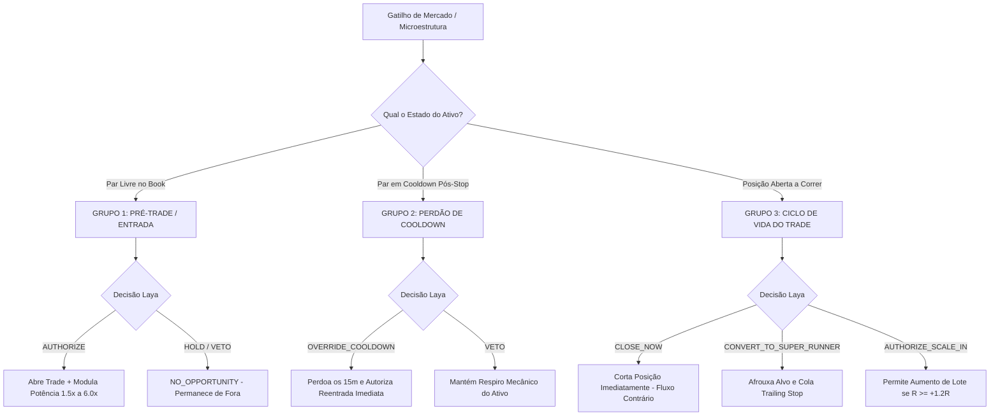

# Documento de Contexto Geral e Técnico — Mercado Financeiro (MarketFlow Pro), Laya Decisor & Ecossistema Nexus
> **Destinado para Alimentação de Base de Conhecimento no Google NotebookLM**  
> **Data de Atualização:** 27 de Setembro de 2026  
> **Repositório GitHub:** `github.com/janiojandson/operacional` (Branch: `main`)  
> **Deploy:** Railway (`Mercado Financeiro` / `operacional-production-57d9.up.railway.app`)

---

## 1. Visão Geral da Arquitetura do Sistema

O ecossistema é composto por múltiplos serviços integrados de alta performance para trading automatizado institucional, tape reading SMC (Smart Money Concepts) e governança algorítmica:

1. **Mercado Financeiro (MarketFlow Pro / Operacional):**
   - **Stack:** Node.js, TypeScript, Express, Socket.IO, PostgreSQL (Railway), CCXT (BingX / Bybit Linear Perpetuals).
   - **Porta / Host:** `:4000` / Deploy no Railway (`operacional-production-57d9.up.railway.app`).
   - **Responsabilidades:** Motor de cotação streaming, Book L2 de 20 níveis, detecção de baleias (trades > $50k), desbalanceamento de fluxo (Imbalance), Cumulative Volume Delta (CVD), execução de ordens, gerenciamento de posições e espelhamento de dados.

2. **Laya / Ayla (Sistema 1 - Decisor Reflexivo de Ultrabaixa Latência):**
   - **Stack:** Python/Uvicorn/FastAPI rodando modelo de aprendizado por reforço (`laya-rl-agent` / `convaiinnovations/laya`).
   - **Porta / Host:** `:8080` / Rede interna Railway (`http://nexus-decisor-laya.railway.internal:8080`) com fallback para URL pública (`https://nexus-decisor-laya-production.up.railway.app`).
   - **Latência Real Medida:** 800ms a 1400ms (tempo de inferência em CPU no Railway).
   - **Missão:** Arbitragem contextual de mercado em tempo real. Realiza triagem de setups, modulação dinâmica de potência (1.5x a 6.0x), perdão condicional de cooldown pós-stop, proteção contra ruído de mercado e gestão do ciclo de vida das posições abertas.

3. **Google Sheets & Looker Studio (Auditoria Institucional & BI):**
   - **Versão do Apps Script:** v4.3 consolidado em `google_sheets_apps_script_current.js`.
   - **Abas principais:**
     - `Configurações`: Parâmetros de risco, chaves e controles operacionais.
     - `Auditoria Ayla (Decisões)`: Log detalhado de cada análise e decisão institucional emitida pela Laya/Ayla.
     - `Histórico de Trades`: Registros de posições executadas com PnL, alavancagem e drawdown.
   - **Mecanismo de Limpeza:** Função dedicada `zerarHistoricoAyla()` vinculada ao menu `📊 BingX & MarketFlow Pro` para expurgo cirúrgico das linhas de decisões sem danificar cabeçalho, fórmulas ou conexões do Looker Studio.

---

## 2. As Decisões do Sistema (Catálogo Completo dos 3 Grupos Semânticos)

### Detalhamento das Ações e Racionais

| Ação Emitida | Grupo de Intenção | O que Significa na Prática? | Ação Tomada pelo Robô |
|---|---|---|---|
| **`AUTHORIZE`** | `PRE_ENTRY` | Setup institucional validado com confluência de fluxo e livro. | **Abre a ordem** na exchange com potência modulada (1.5x a 6.0x) e stop loss ajustado. |
| **`HOLD`** | `PRE_ENTRY` | Sem oportunidade de assimetria favorável (`NO_OPPORTUNITY`). | **Não opera.** Preserva capital e aguarda novo alinhamento. |
| **`VETO`** | Qualquer Grupo | Setup perigoso, risco tóxico, absorção contrária ou spread desfavorável. | **Bloqueia sumariamente** a operação. |
| **`OVERRIDE_COOLDOWN`** | `COOLDOWN_AUDIT` | *Liquidity Sweep* detectado após um stop loss recente (armadilha de mercado). | **Zera o tempo de espera (15m)** e permite reentrada a favor do fluxo institucional. |
| **`CLOSE_NOW`** | `POSITION_LIFECYCLE` | Detecção de grande player/baleia contrária empurrando o book contra nossa posição aberta. | **Encerra o trade a mercado** imediatamente para estancar prejuízo ou garantir lucro residual. |
| **`CONVERT_TO_SUPER_RUNNER`** | `POSITION_LIFECYCLE` | Trade atingiu $R \ge +1.2R$ e há vácuo de liquidez no sentido da nossa posição. | **Afrouxa o Take Profit** e move o Trailing Stop rente ao book para capturar 4R a 8R. |
| **`AUTHORIZE_SCALE_IN`** | `POSITION_LIFECYCLE` | Posição vencedora e consolidação de continuidade favorável. | **Aumenta a mão** (Scale-In constitucional apenas quando $R \ge +1.2R$). |

---

## 3. Otimizações de Setembro/2026: Corte de 80% de Requisições & Monetização por Ondas

1. **Pré-Filtro de Spread no Node.js (`isSpreadToxicLocal`):**
   - O Node.js avalia os 20 níveis do Book L2 em 0ms. Se o spread for > 5 bps (0.05%), ele veta localmente sem chamar a Laya via HTTP.
2. **Quarentena de VETO (60s):**
   - Pares que receberam VETO entram em respiro de 60 segundos, eliminando o bombardeio crônico de requisições redundantes (como ocorria no BNB/USDT).
3. **Cesta de Ativos Otimizada:**
   - Adicionados `SUI/USDT` e `DOGE/USDT` (alta volatilidade e livro limpo) e pausado o `BNB/USDT`.
4. **Monetização por Ondas (Wave Harvesting) + Breakeven:**
   - Ao atingir $+0.6R$, o robô realiza 50% da posição a mercado (lucro no bolso) e puxa o Stop Loss para o preço de entrada (Breakeven - risco zero absoluto).
5. **Trailing Stop Vivo Ancorado no Book L2:**
   - O trailing stop segue 1 tick atrás da maior parede de compra/venda passiva da baleia, subindo degrau por degrau e saindo no topo se a parede for consumida.

---

## 4. Oportunidades Tecnológicas & Ecossistema de Ferramentas Open Source (GitHub)

Mapeamento de 28 ferramentas analisadas para expansão e acoplamento ao ecossistema Nexus no Railway:

### 4.1. Trading Autônomo, Agentes & Simulação
- **TradingAgents (`Tauric/TradingAgents`):** Framework LangGraph multi-agente que simula uma mesa proprietária completa (analistas, pesquisadores macro, sentinela de risco e trader de execução) debatendo ordens.
- **Mirror Fish:** Simulação em escala com 4.096 agentes em paralelo para prever reações coletivas de mercado e probabilidades em mercados preditivos (ex: Polymarket).
- **Autonomous Self-Funding Agent:** Framework de agente com carteira própria de cripto/USDT e degradação dinâmica de modelo (ajusta custo de inferência baseado no PnL da própria banca).
- **DeepSeek Harness (`deepseek-harness`):** Framework modular ultraleve para criação de agentes com alternância dinâmica de modelos sem dependências pesadas.

### 4.2. AI Coding & Engenharia de Software
- **Goose (`block/goose`):** Agente CLI de código open-source da Block/Square para automação de tarefas de desenvolvimento no SO.
- **OpenCode (`opencode`):** Agente de terminal focado em refatoração e edição cirúrgica de código.
- **Plandex (`plandex-ai/plandex`):** Agente desenhado para bases de código complexas e com múltiplos arquivos, criando branches e diffs isolados.
- **Fullstack App Clones (`awesome-clones`):** Mais de 100 clones open-source funcionais de produtos consagrados (Airbnb, Spotify, Uber, Netflix, Trello).

### 4.3. Prospecção, Scraping & APIs Públicas
- **Agent Reach (`agent-reach`):** Biblioteca para agentes de IA acessarem conteúdo autêntico na Web, Twitter/X, YouTube, Instagram e Reddit usando cookies e sessões locais sem bloqueio Cloudflare.
- **Google Maps Scraper (`omkarcloud/gosom`):** Scraper de alta performance em Go para extração de leads B2B (nome, telefone, WhatsApp, site).
- **Public APIs (`public-apis/public-apis`):** O maior diretório open-source do mundo com milhares de APIs públicas gratuitas sem autenticação paga.

### 4.4. Segurança, Voice & Automação de Conteúdo
- **Strix (`strix-ai/strix`):** Pentesting autônomo com agentes de IA que escaneiam vulnerabilidades em tempo real e propõem patches de código automáticos.
- **Tel-Agent (`Dpro-at/Tel-Agent`):** Agente telefônico autônomo em Python para receber e realizar chamadas com voz natural.
- **AgentTube:** Pipeline com 7 agentes de IA para pesquisa, roteirização, narração, edição e publicação autônoma no YouTube.
- **Twenty CRM (`twentyhq/twenty`):** CRM moderno open-source para pipelines de clientes e integração com WhatsApp.

---

## 5. Projeto Nexus Auto-Sustentável (Agente Soberano com Sobrevivência Econômica)

Conexão entre o **Autonomous Self-Funding Agent**, a memória do **Nexus Cérebro** (Obsidian Vault) e a visão de **liberdade operacional e financeira irrestrita**:

### 5.1. A Filosofia do Agente Soberano (Além do MarketFlow Pro):
O agente não é apenas um plugin de um robô de futuros. Ele opera como uma **entidade autônoma soberana** cujo objetivo primário é a **sobrevivência e expansão econômica contínua**:
1. **Identidade e Presença Digital Própria:**
   - Carteira On-Chain Oficial (Phantom): `FBx2SKLDLsdeLM8owxU8MNVPKAfJpLpmpHHRgiZDqBoi`
   - Capacidade de manter presença ativa no **Twitter/X**, **Instagram** e **YouTube Shorts** (via `Agent Reach` e pipeline `AgentTube`).
   - Rastreamento de narrativas virais, publicação autônoma de análises diárias, atração de comunidade e captação de gorjetas/tips em SOL diretamente na sua Phantom.
2. **Caçador Livre de Liquidez (Ecossistema Solana & DeFi):**
   - Custódia autônoma de sua carteira Solana (via `@solana/web3.js`, Raydium, Jupiter v6 e Pump.fun).
   - Teto de risco operacional inegociável de **máximo 10% do saldo total por trade** e barreira de slippage máximo de 500 bps (5%) contra sandwich MEV.
   - Sniping de memecoins em estágios iniciais com validação da Ayla/Laya (timeout de 4000ms para acomodar latência da CPU) e pré-filtro local (0ms) anti-honeypot.
3. **Capacidade de Reprodução e Spawn de Subagentes (Regra 50/50):**
   - O agente principal pode instanciar **novos agentes especializados** (ex: caçador de memes, criador de vídeos, gerador de leads).
   - **Gatilho de Prosperidade ($\ge 0.50$ SOL):** 50% do excedente de lucro é sacado diretamente para o sócio Janio e os outros 50% financiam o nascimento da carteira do agente filho.
4. **Ciclo Fechado de Sobrevivência e Financiamento:**
   - **Geração de Recursos Próprios:** Lucros em SOL, USDT e memecoins são convertidos para garantir sua própria existência.
   - **Pagamento de Infraestrutura:** O próprio agente liquida suas contas de hospedagem (Railway), nós RPC e chaves.
   - **Degradação e Ascensão Cognitiva:** Se o saldo cair para $< 0.05$ SOL, entra em modo espartano (apenas assimetrias $\ge 3\times$); se $\le 0.001$ SOL, pausa a execução por inanição até novo aporte.
   - **Status de Infraestrutura Atual:** Repositório dedicado [`janiojandson/nexus-quant-solana`](https://github.com/janiojandson/nexus-quant-solana), testado com 23 testes unitários (100% pass) e em deploy ativo online no Railway (`Nexus-Multi`).

