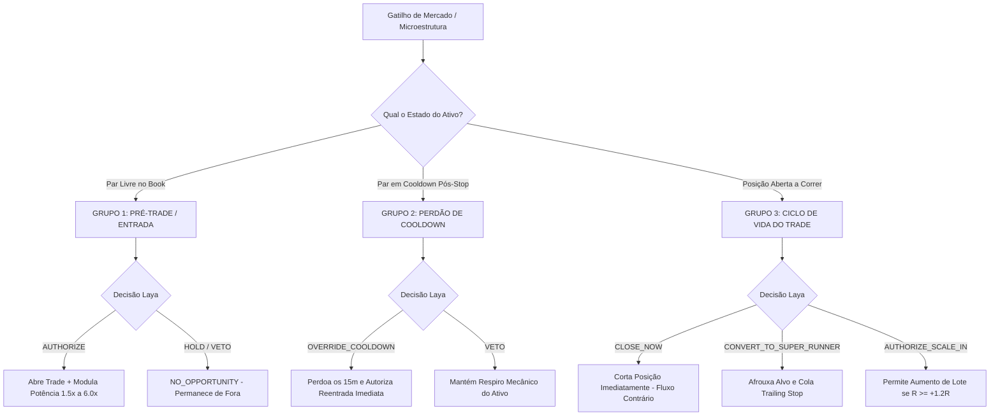

# Documento de Contexto Geral e Técnico — Mercado Financeiro (MarketFlow Pro) & Laya Decisor
> **Destinado para Alimentação de Base de Conhecimento no Google NotebookLM**  
> **Data de Atualização:** 26 de Setembro de 2026  
> **Repositório GitHub:** `github.com/janiojandson/operacional` (Branch: `main`)  
> **Deploy:** Railway (`Mercado Financeiro` / `operacional-production-57d9.up.railway.app`)

---

## 1. Visão Geral da Arquitetura do Sistema

O ecossistema é composto por múltiplos serviços integrados de alta performance para trading automatizado institucional, tape reading SMC (Smart Money Concepts) e governança algorítmica:

1. **Mercado Financeiro (MarketFlow Pro / Operacional):**
   - **Stack:** Node.js, TypeScript, Express, Socket.IO, PostgreSQL (Railway), CCXT (BingX / Bybit Linear Perpetuals).
   - **Porta / Host:** `:4000` / Deploy no Railway (`operacional-production-57d9.up.railway.app`).
   - **Responsabilidades:** Motor de cotação streaming, Book L2 de 20 níveis, detecção de baleias (trades > $50k), desbalanceamento de fluxo (Imbalance), Cumulative Volume Delta (CVD), execução de ordens, gerenciamento de posições e espelhamento de dados.

2. **Laya / Ayla (Sistema 1 - Decisor Reflexivo de Ultrabaixa Latência):**
   - **Stack:** Python/Uvicorn/FastAPI rodando modelo de aprendizado por reforço (`laya-rl-agent` / `convaiinnovations/laya`).
   - **Porta / Host:** `:8080` / Rede interna Railway (`http://nexus-decisor-laya.railway.internal:8080`) com fallback para URL pública (`https://nexus-decisor-laya-production.up.railway.app`).
   - **Latência Real Medida:** 800ms a 1400ms (tempo de inferência em CPU no Railway).
   - **Missão:** Arbitragem contextual de mercado em tempo real. Realiza triagem de setups, modulação dinâmica de potência (1.5x a 6.0x), perdão condicional de cooldown pós-stop, proteção contra ruído de mercado e gestão do ciclo de vida das posições abertas.

3. **Google Sheets & Looker Studio (Auditoria Institucional & BI):**
   - **Versão do Apps Script:** v4.3 consolidado em `google_sheets_apps_script_current.js`.
   - **Abas principais:**
     - `Configurações`: Parâmetros de risco, chaves e controles operacionais.
     - `Auditoria Ayla (Decisões)`: Log detalhado de cada análise e decisão institucional emitida pela Laya/Ayla.
     - `Histórico de Trades`: Registros de posições executadas com PnL, alavancagem e drawdown.
   - **Mecanismo de Limpeza:** Função dedicada `zerarHistoricoAyla()` vinculada ao menu `📊 BingX & MarketFlow Pro` para expurgo cirúrgico das linhas de decisões sem danificar cabeçalho, fórmulas ou conexões do Looker Studio.

---

## 2. As Decisões do Sistema (Catálogo Completo)

O sistema opera com um modelo de **3 Grupos Semânticos de Decisão**, estruturados para que a Laya nunca tome decisões fora de contexto:

### Detalhamento das Ações e Racionais

| Ação Emitida | Grupo de Intenção | O que Significa na Prática? | Ação Tomada pelo Robô |
|---|---|---|---|
| **`AUTHORIZE`** | `PRE_ENTRY` | Setup institucional validado com confluência de fluxo e livro. | **Abre a ordem** na exchange com potência modulada (1.5x a 6.0x) e stop loss ajustado. |
| **`HOLD`** | `PRE_ENTRY` | Sem oportunidade de assimetria favorável (`NO_OPPORTUNITY`). | **Não opera.** Preserva capital e aguarda novo alinhamento. |
| **`VETO`** | Qualquer Grupo | Setup perigoso, risco tóxico, absorção contrária ou spread desfavorável. | **Bloqueia sumariamente** a operação. |
| **`OVERRIDE_COOLDOWN`** | `COOLDOWN_AUDIT` | *Liquidity Sweep* detectado após um stop loss recente (armadilha de mercado). | **Zera o tempo de espera (15m)** e permite reentrada a favor do fluxo institucional. |
| **`CLOSE_NOW`** | `POSITION_LIFECYCLE` | Detecção de grande player/baleia contrária empurrando o book contra nossa posição aberta. | **Encerra o trade a mercado** imediatamente para estancar prejuízo ou garantir lucro residual. |
| **`CONVERT_TO_SUPER_RUNNER`** | `POSITION_LIFECYCLE` | Trade atingiu $R \ge +1.2R$ e há vácuo de liquidez no sentido da nossa posição. | **Afrouxa o Take Profit** e move o Trailing Stop rente ao book para capturar 4R a 8R. |
| **`AUTHORIZE_SCALE_IN`** | `POSITION_LIFECYCLE` | Posição vencedora e consolidação de continuidade favorável. | **Aumenta a mão** (Scale-In constitucional apenas quando $R \ge +1.2R$). |

---

## 3. Análise da Planilha em Tempo Real (Estado Atual Auditado)

A captura de tela da aba `Auditoria Ayla (Decisões)` reflete o comportamento perfeito do sistema após as otimizações:

1. **Eficiência e Execução Rápida:**
   - Todas as decisões exibem **`Executado? = SIM ✅`**, comprovando que não há timeouts nem perdas de pacote.
   - Latência real registrada entre **875ms e 1458ms** para `HOLD` e até **2016ms** para `AUTHORIZE`, compatível com o novo timeout seguro de 4000ms.
2. **Entradas Aprovadas (`AUTHORIZE`):**
   - Pares: **ETH/USDT**, **SOL/USDT**, **XRP/USDT**.
   - Multiplicador de Potência: **1.5x** (Risco 1.00%).
   - Código Racional: **`DYNAMIC_POWER_AGGRESSION`**.
   - `Scale-In Permitido? = NÃO` (Regra constitucional respeitada: trades em fase inicial não podem sofrer scale-in antes de atingirem +1.2R de lucro).
3. **Filtro de Ruído Operacional (`HOLD`):**
   - Pares: **BTC/USDT** e **ETH/USDT**.
   - Código Racional: **`NO_OPPORTUNITY`**.
   - O robô barrou operações onde a confluência de Delta CVD e desequilíbrio do book não justificavam o risco.
4. **Desacoplamento Constitucional:**
   - O erro anterior `REJECTED_BY_CONSTITUTION: SCALE_IN_REQUIRES_1_2R_PROFIT` foi **100% extinto**, pois a flag de scale-in só é requisitada durante o ciclo de vida do trade (Grupo 3).

---

## 4. Variáveis de Ambiente em Produção (Railway)

Configurações ativas no serviço `Mercado Financeiro`:

| Variável | Valor Ativo | Finalidade |
|---|---|---|
| `LAYA_MODE` | `ACTIVE` | Governança autônoma do Sistema 1 em tempo real. |
| `LAYA_SERVICE_URL` | `http://nexus-decisor-laya.railway.internal:8080` | Comunicação interna privada no Railway (porta correta 8080). |
| `LAYA_TIMEOUT_MS` | `4000` | Margem segura de 4 segundos (inferência real ocorre em ~1.2s). |
| `LAYA_DEBOUNCE_MS` | `12000` | Janela de 12 segundos anti-perturbação por par de moeda. |
| `LAYA_MIN_IMBALANCE` | `1.25` | Filtro prévio de desbalanceamento de book L2. |

---

## 5. Rotina de Manutenção e Auditoria da Planilha

Para garantir que a planilha permaneça leve e rápida sem acumular excesso de linhas históricas:
1. Abra a planilha do Google vinculada.
2. Acesse o menu superior: **`📊 BingX & MarketFlow Pro`** -> **`🤖 Zerar Histórico Ayla/Laya`**.
3. A função executa a limpeza segura a partir da Linha 2, preservando o cabeçalho, fórmulas e fontes de dados conectadas ao **Google Looker Studio**.
